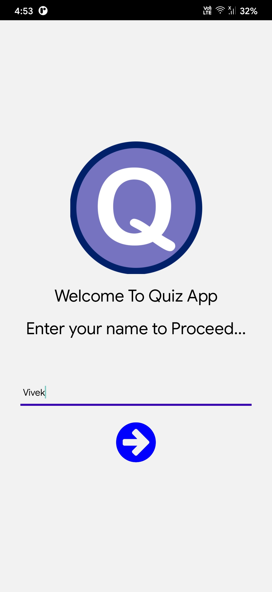
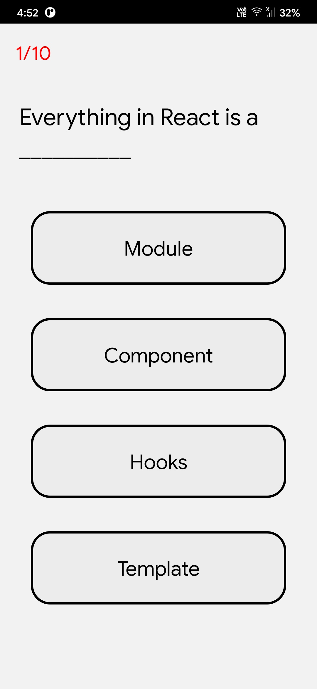

# quizApp ❓
Customisable quizApp made in react native

## Features ⚛️

- Customisable Questions

## Screenshots 🖼️





## Questions.json ❔

```
{
questions:[
     { 
        question: "Example Question",
        answers: ["Option 1","Option 2","Option 3", "Option 4"], // 4 options
        correctIndex: 2 // Index of the correct option 
    }
]
}
```


## How to build? 🏗️

https://reactnative.dev/docs/signed-apk-android

## Contributing/ Future of this project 🧭

Well, this project is one of my side projects. If anyone interested in making it better you're always welcome 🤗

## Things I learned by doing this project

- Global state management in React native using redux and context
- Practical example of stack navigator
- Screen navigation
## Anything more?

If you liked my work, consider staring the repository and spread the word. ⭐️